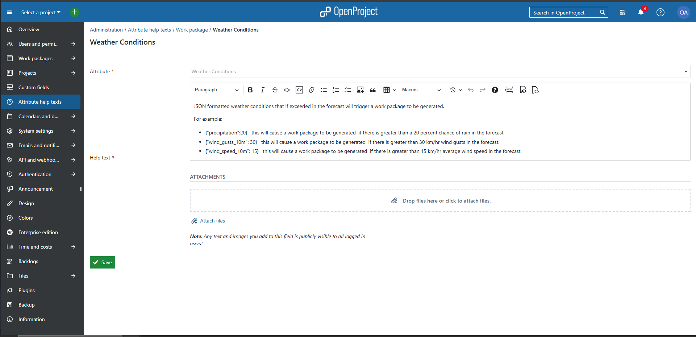

# About
Open Project Automation Scripts is a container that can be used to program complex automations such as recurring tasks.

# Recurring Tasks Setup Guide
To setup recurring tasks in open project using the open create the following custom fields inside of the open project instance.  
Custom fields are split into two categories, temporal and weather event.  

Temporal meaning fields are required for creating work packages based on time and work package status.  
Weather event fields are required for creating work packages based on weather events and is built using open-meteo.

* Note that the names of the fields, as well as the options for each field __are__ case sensitive.  
* Also note that the fields should __not__ be required or for all projects, only the projects where the work packages functioning as templates live.

Screen shots of each field are shown for convenience.

Once the fields are created, rename the file .env.example to .env and edit the entries match your setup, then run
```
    docker compose up -d
```
to start the container. Note that valid latitude and longitude values are only required if using the Weather Forecast algorithm.

## Template Work Package Examples
Once the custom fields are in place and activated in the project that will house the template work packages. Creating a recurring work package is as easy as creating a new work package and filling out the fields.  

### Fixed Interval
In the image below, I have created a work package that will be cloned into the project named Main on a fixed interval every 7 days, regardless of the previous iterations status.


### Fixed Delay
In the image below, I have created a work package that will be cloned into the project named Main on a 28 days after the previous iteration is completed. Put another way on day zero, a new work packages will appear in the project named Main. Once that clone work packages no longer has an open status, a new clone will be created 28 days after the first clone changed to a closed status.


### Fixed Day Of Month

In the image below, I have created a work package that will be cloned into the project named Main on the 11th of each month. Note that the day must exist in the month, or the work package will not be cloned.


### Fixed Day Of Year

In the image below, I have created a work package that will be cloned into the project named Main on the 6th of each September every year. Note that the day must exist in the month, or the work package will not be cloned.


### Weather Forecast

In the image below, I have created a work package that will be clone into the project Main when the precipitation chance goes above 0 anytime in the next two days.. The template will only be cloned on the rising edge of the forecast exceeding the any of the specified parameters. Put another way, if it storms every day for a week, this template will only be created one day before the first storm, as the transition from no storms in the next day to storms in the next day occurs only prior to the first day or stormy weather.


## Temporal Recurring Fields
Temporal recurring fields are required, as they provide the necessary data for the scripts to calculate dates when creating
new work packages.

* Auto Scheduling Algorithm  
    type: List  
    description/help-text:  
    ```md
    Algorithm to use when automatically creating work packages.

    If Auto Scheduling Algorithm is set to:

    *   **Fixed Interval**:
        
        *   Clones the work package into the target project on the given interval from the work packages start date.
            
    *   &nbsp;**Fixed Delay**:
        
        *   Clones the work package into the target project an interval number of days after the last one is completed.
            
    *   **Fixed Day Of Month:**
        
        *   Clones the work package into the target project project on this day of the month every month (if it has that day)

    *   **Fixed Day Of Year:**

        *   Clones the work package into the target project on the date every year.
            Note, that the date precedence used is start date, then due date, and finally date.
            
    *   **Weather Forecast:**
        
        *   Clones the work package into the target project if the weather codes are found in the forecast within the interval from the current date.   
    ```

    options: 
    - Fixed Interval
    - Fixed Delay
    - Fixed Day Of Month
    - Weather Forecast  
      
    

* Interval/Day Of Month  
    type: Integer.  
    description/help-text:  
    ```md
        If Auto Scheduling Algorithm is set to:

    *   &nbsp;**Fixed Interval**:
        
        *   Clones the work package into the target project on the given interval from the work packages start date.
            
    *   **Fixed Delay**:
        
        *   Clones the work package into the target project an interval number of days after the last one is completed.
            
    *   **Fixed Day Of Month:**
        
        *   Clones the work package into the target project project on this day of the month every month (if it has that day)

    *   **Fixed Day Of Year:**

        *  **N/A**
            
    *   **Weather Forecast:**
        
        *   Clones the work package into the target project if the weather codes are found in the forecast within the interval from the current date.k package into the target project if the weather codes are found in the forecast within the interval from the current date.
    ```

    

* Target Project
    type: List  
    description/help-text:
    ```md
    Project this work package should be cloned into.
    ```
    

## Weather Event Recurring Fields (Optional)
Weather event recurring fields are optional and allow the automation scripts to create work packages based on weather events.  

* Weather Conditions
    type: Text  
    description/help-text:  
    ```md
        JSON formatted weather conditions that if exceeded in the forecast will trigger a work package to be generated.

    For example:

    * {"precipitation":20}   this will cause a work package to be generated  if there is greater than a 20 percent chance of rain in the forecast.

    * {"wind_gusts_10m":30}   this will cause a work package to be generated  if there is greater than 30 km/hr wind gusts in the forecast.

    * {"wind_speed_10m":15}   this will cause a work package to be generated  if there is greater than 15 km/hr average wind speed in the forecast.
        

    see [https://open-meteo.com/en/docs](https://open-meteo.com/en/docs) for more info
    ```

    

* Weather Detected Status
    type: Boolean  
    description/help-text:
    ```md
    Flag that goes true when the weather codes are in the forecast, and false when they are not.

    The auto-scheduling algorithm only generates new work packages when the transition from false to true is detected.

    ```
    